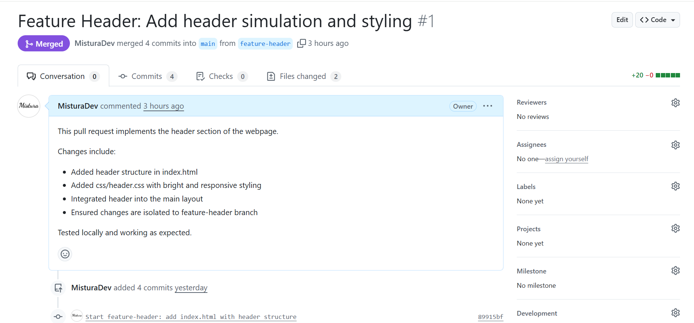
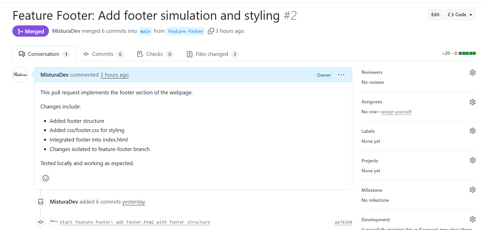

# Frontend-version-control-task-Mistura

This repository demonstrates my understanding of version control workflows, Git commands, branch management, pull requests, merging and reversion practices. 
It simulates a frontend project with a header and footer feature.

---

## Objective

This project was completed as part of a version control deliverable to demonstrate understanding of:

- Repository initialization and management  
- Branching & collaboration  
- Commits & pushes  
- Pull requests, reviews and merges  
- Conflict resolution and reversion  

---

## Branch Names & Purpose

| Branch Name                                            | Purpose                                               |
| ------------------------------------------------------ | ----------------------------------------------------- |
| `main`                                                 | Base branch where all final code is merged            |
| `feature-header`                                       | Implement and style the header section of the webpage |
| `feature-footer`                                       | Implement and style the footer section of the webpage |

---

## Git Commands Used Most Frequently

- git branch – check local branches

- git checkout <branch> – switch branches

- git add <file> – stage changes

- git commit -m "<message>" – commit staged changes

- git push origin <branch> – push commits to remote

- git merge <branch> – merge a branch into current branch

- git stash / git stash pop – temporarily save local changes

- git branch -m <old> <new> – rename a branch

- git revert <commit> – undo a commit by creating a new revert commit

- git push origin --delete <branch> – delete remote branch

---

## Pull Requests & Merges

1. **Feature Header:** Merged into `main`  
   - [PR #1 - Feature Header](https://github.com/MisturaDev/Frontend-version-control-task-Mistura/pull/1)  

2. **Feature Footer:** Merged into `main`  
   - [PR #2 - Feature Footer](https://github.com/MisturaDev/Frontend-version-control-task-Mistura/pull/2)  

> All PRs were reviewed, tested locally and merged successfully.

---

## Screenshots of Merged PRs

| Header | Footer |
|------|--------|
|  |   |

---

## Reversion & Cleanup

- Demonstrated a **revert commit**:
  
  added a minor comment in **index.html** and then reverted it

- Demonstrated a **branch rename**:
  
  **feature-header - feature-header-renamed**

---

## Lessons Learned

- Always ensure you are on the correct branch before committing changes

- Stashing is useful for temporarily saving changes when switching branches

- Pull requests allow safe code integration and review workflow

- Meaningful commit messages improve project clarity

- Branch isolation keeps header and footer changes separate and manageable

- Revert commits are useful for safely undoing mistakes

- Frequent commits and proper branch management make collaboration and tracking easier

